## Group T07G02

- Daniel dos Santos Ferreira: up202108771
- Maria Eduarda Rabelo: up202000130

## Project Notes

## Bee's controls

- `W`: Accelerate. Increases the bee's x0z speed without changing its movement's direction;
- `S`: Brake. Decreases the bee's x0z speed without changing its movement's direction;
- `A|D`: Turns the bee left and right, respectively, while maintaining its speed;
- `F`: Gain downwards velocity, while maintaining the x0z velocity. The bee will stop its movement when it reaches the top of a flower, or the floor;
- `P`: Gain upwards velocity, while maintaining the x0z velocity. The bee will lose its upwards velocity when it reaches its initial height. The bee will hold a pollen grain if it located immediately over one;
- `O`: Reset the the bee's velocity. Turns the bee and moves it to the nearest hive entrance. Doing any other action cancels the bee's trip to the hive. The bee will drop a collected pollen grain when it reaches a hive's entrance.
- `R`: Restores the bee's initial state;

## 1. Sky-Sphere

To start the project we began with creating a sphere with a parameterizable number of slices, stacks and whether it was visible on the outside or the inside. The biggest challenge in this task was to realise we needed to create the vertices of the first slice twice so that the texture in the sphere would wrap correctly. With the sphere done, adding the panorama wasn't a challenge, as we only needed to create a new material and texture and apply it to the sphere. 

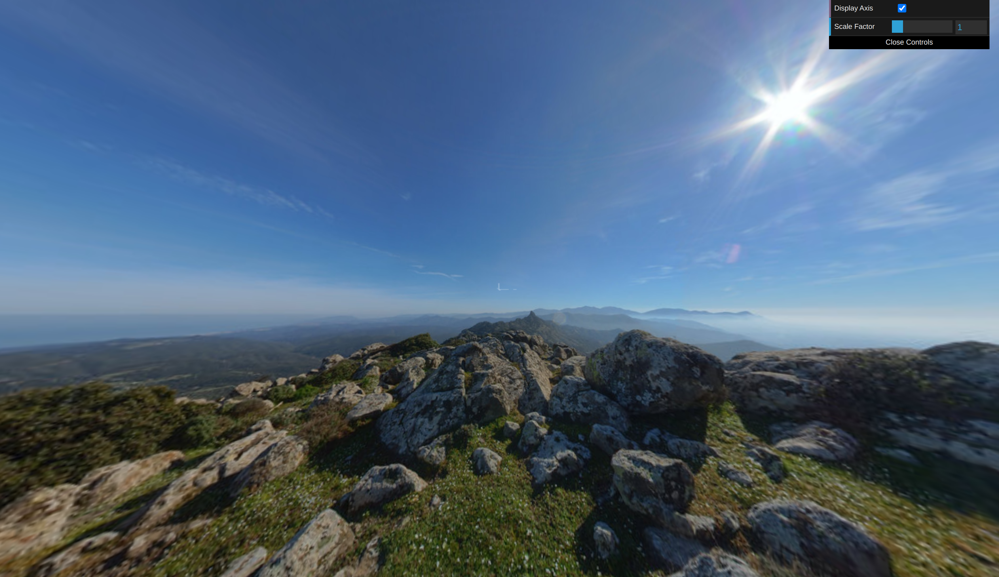
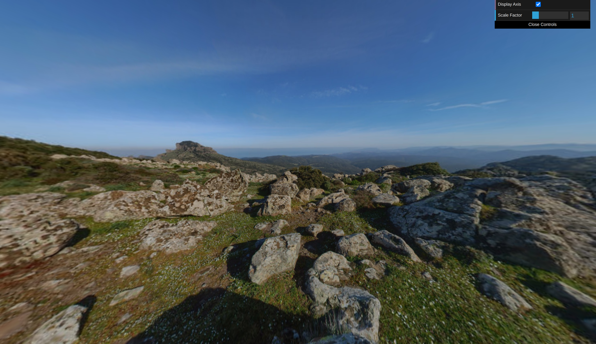

## 2. Flowers

We parametrized the number of petals in our flowers, as well as their inclinations, textures and other attributes that were asked. Between each cylinder that forms the stem, we created a branch, which has a two leaves in it and a unique rotation around the stem and inclination. The most challenging part was to create the stem curvature, which we could achieve by using the curvature angle for defining the x and y translations. 

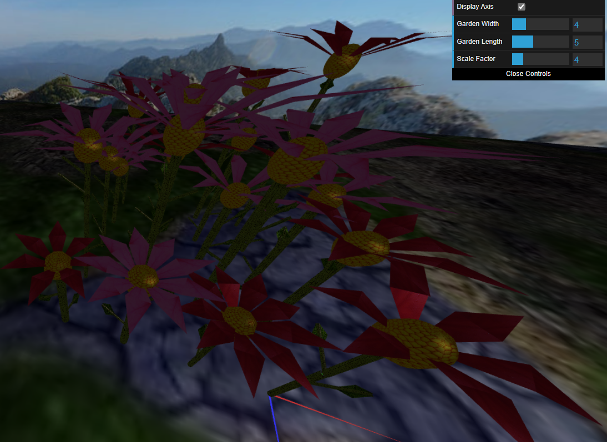
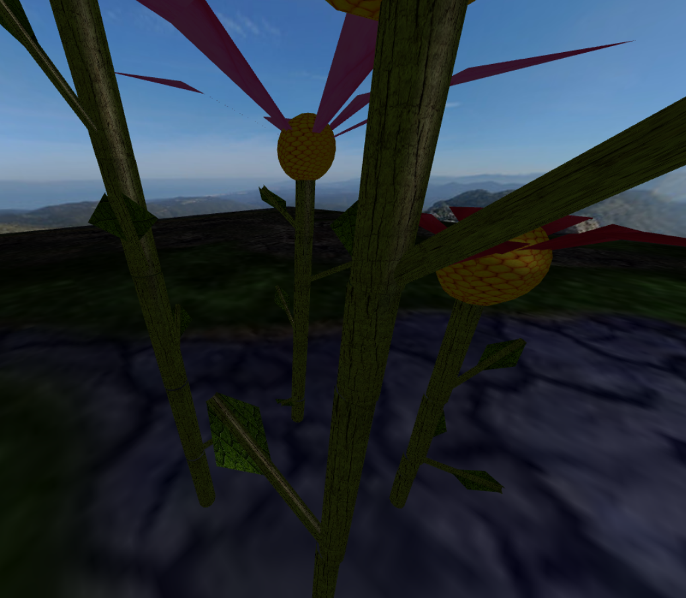

## 3. Rocks and Boulders

Creating a single rock wasn't difficult as a small random offset in each vertex in the direction of its normal was enough to give the sphere a sharp and pointy appearance. The biggest challenge was creating the rock set, since we had to devise a strategy to avoid the collision between rocks. To do so we defined a squared area to display a set of rocks. That area was divided in a grid in which each rock had a particular space to be displayed. A random but controled offset was added to each rock to randomize the rock generation while avoiding collision. Finally the rock pyramid was an easier task, despite the difficulty of finding a good balance between randomness and a good pyramid structure.

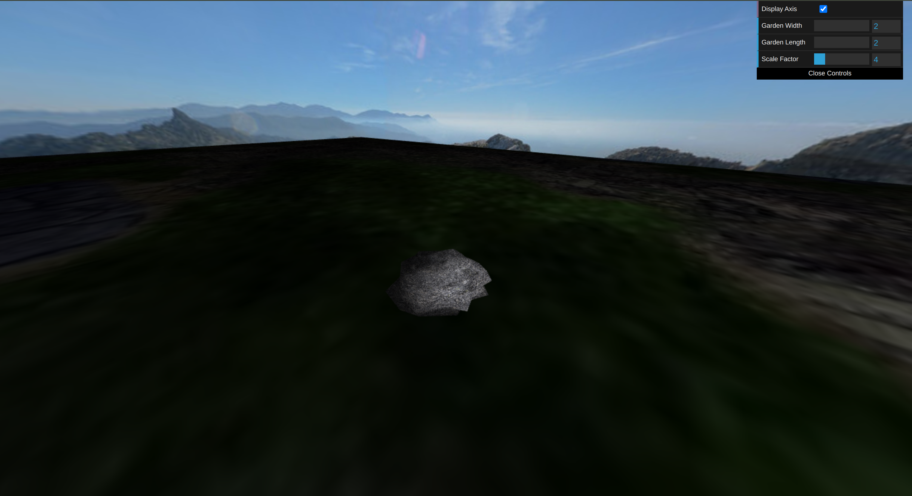
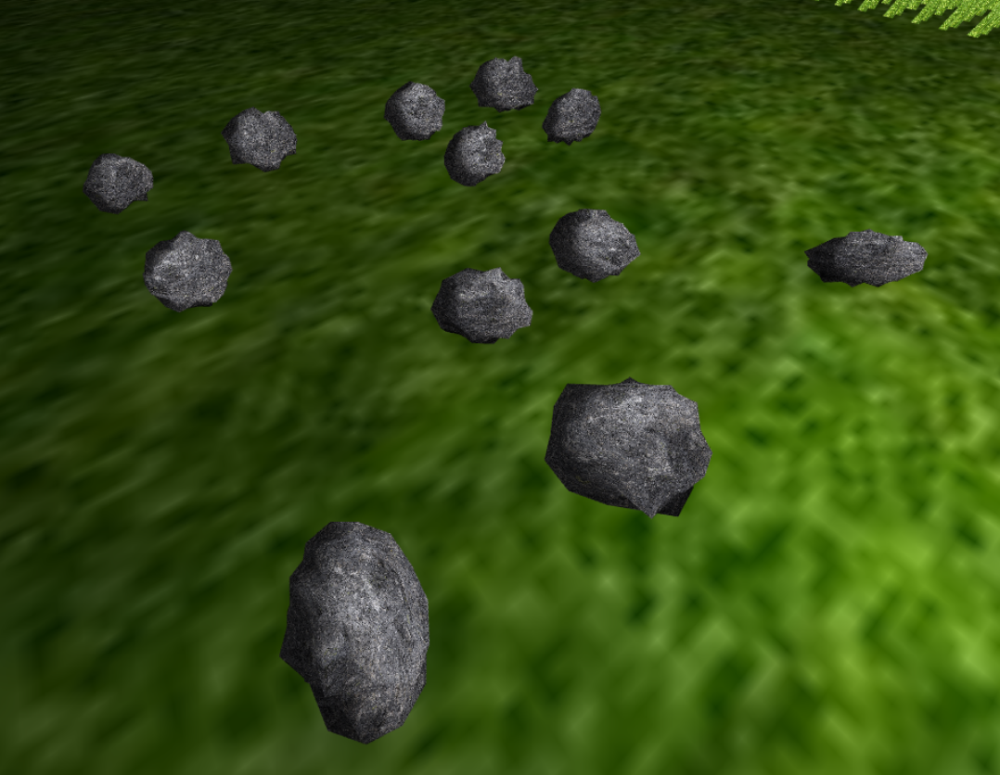
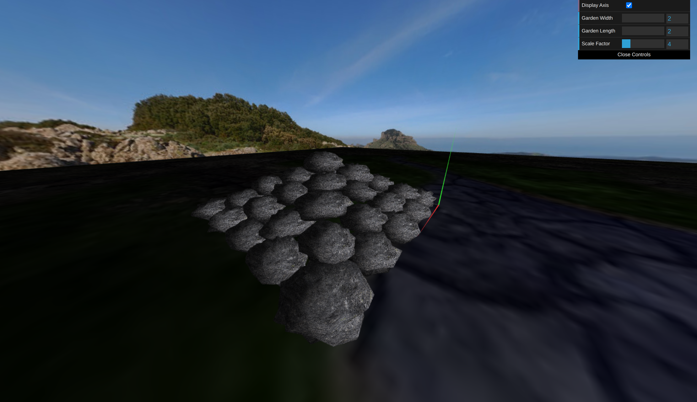

## 4. Bee

In regards to the bee, its modelling involved a lot of magic constants which could probably had been improved with more time. Also, the non attentive reading of the project's statement resulted in the mistake of not modelling the bee to have a maximum of 2 units in length without any scaling, which resulted in some time loss. Other than that, the development of the basic bee movement functionalities went smoothly. 

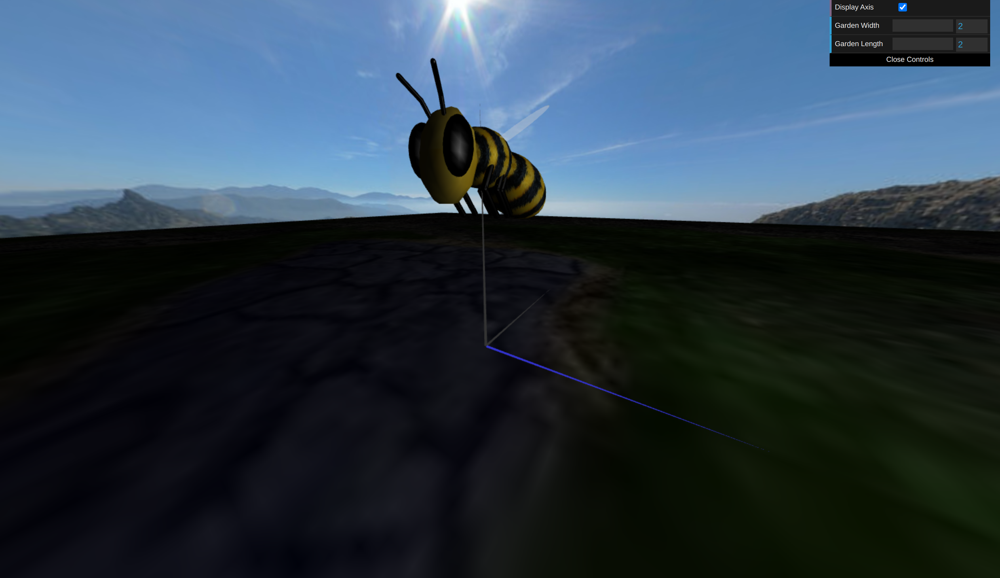

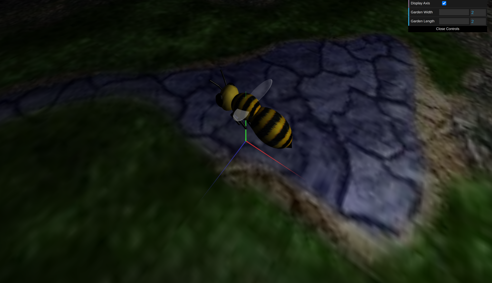

## 5. Pollen and Hive

For creating the pollen, we added a new parameter to the sphere constructor, topYScale, so we could have a longer top hemisphere. Our first attempt for creating the pollen was using a shader for changing the vertices y positions. We noticed that it slowed the scene down, which was solved by the sphere topYScale attribute. 

We created the hive with two cubes, being one of them for represnting the hive cover. We also created a hole so that the bee could drop its collected pollens, which are displayed inside the hive.

As to the more complex bee actions, they were handled with a simple state machine and the most complex task was to handle the collisions with the flower's receptacle. As an additional feature, the bee avoids colliding with the modern hive and travels to the closest entrance. 

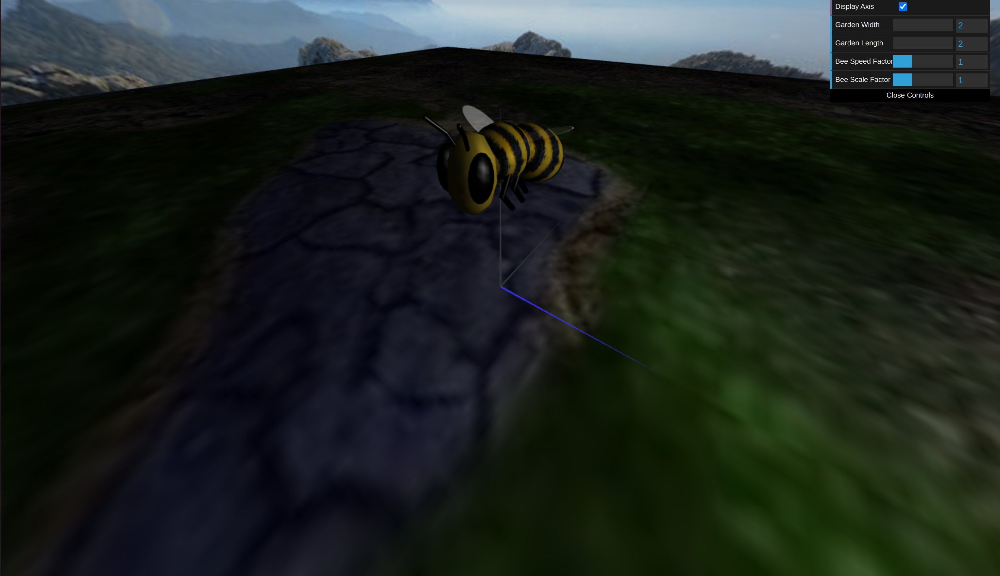

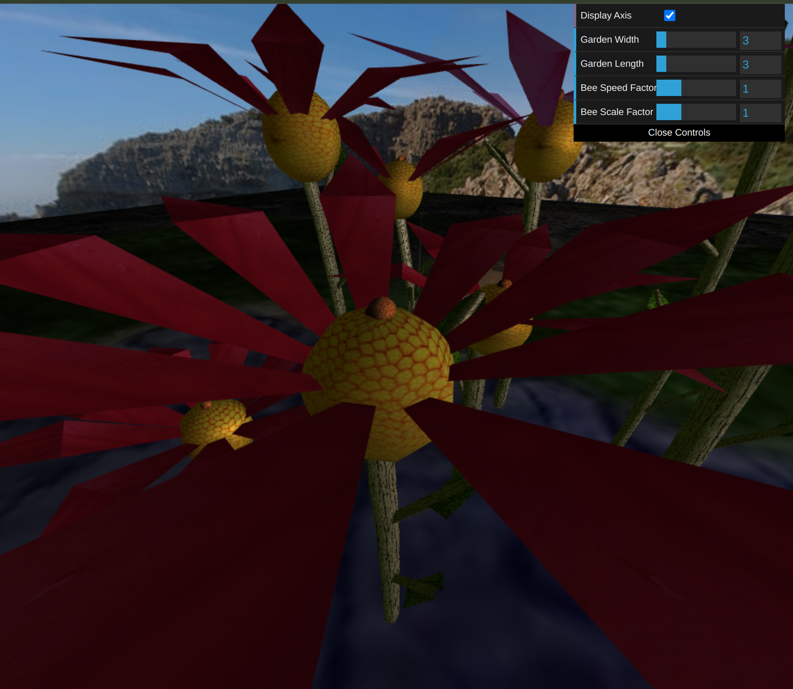
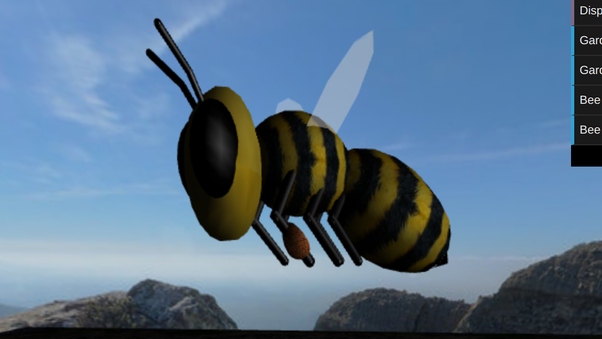
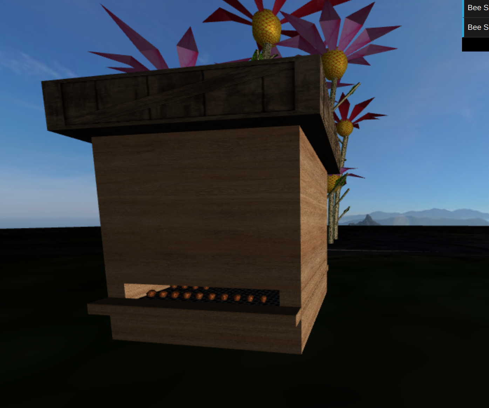

## 6. Shaders and animation

For simulating wind movement, we used shaders for the grass animation. To do so we bent the highest points of each grass leaf more than the points near the bases. In addition to that, each leaf had a different height and base length, and a different start time, which randomized the grass creation, providing a more realistic appearance. 

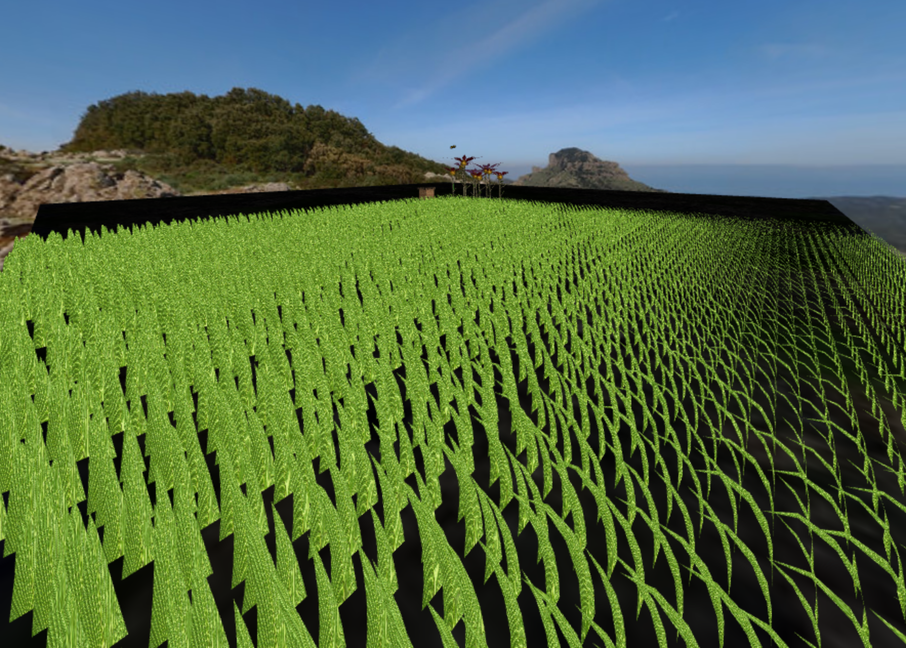

## 7. Additional developments 

For the additional development we chose to display moving clouds in the panorama's sky. To do so we used shaders, using a similar approach to the one used in the fifth practical class.

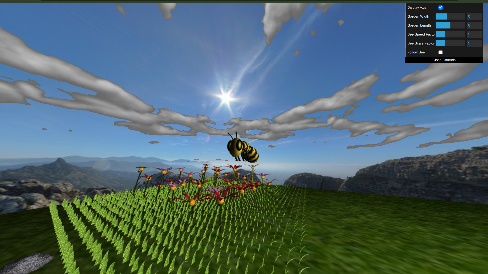
