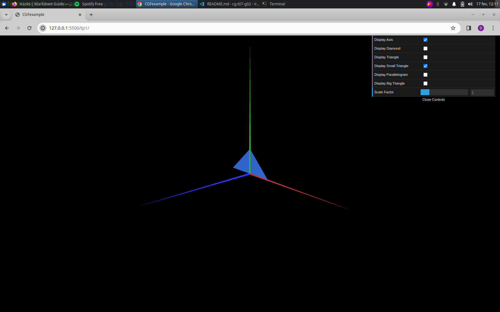

# CG 2023/2024

## Group T07G02

## TP 1 Notes

- In exercise 1 we built a triangle and a parallelogram using the provided diamond as an example. We also added checkboxes to control if an element should be displayed or not. The most challenging aspect of this exercise was making the parallelogram double-sided which was obtained by repeating the entries in the `indices` list in reverse order (in clockwise winding order).
- We solved the second exercise without any difficulty as we simply had to repeat the same procedures followed in the first exercise. 

