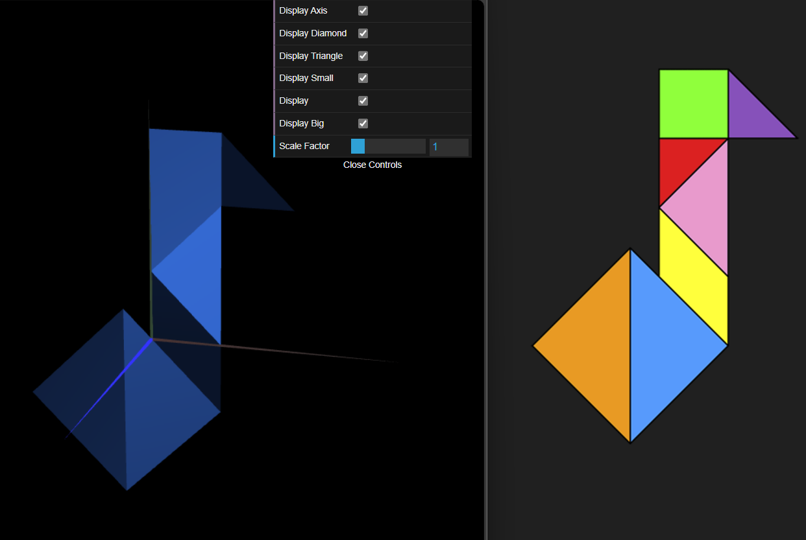
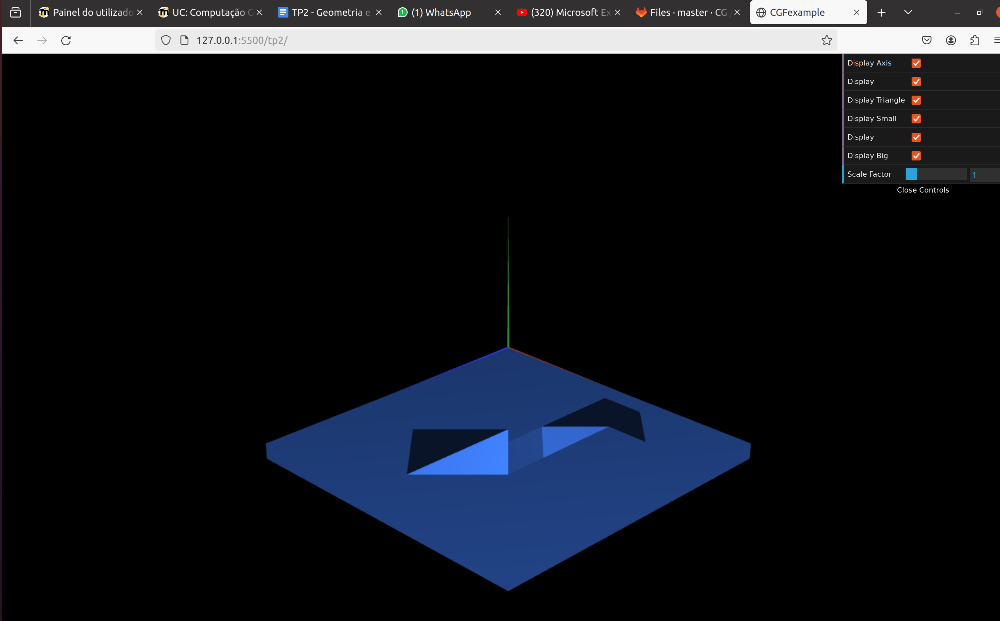
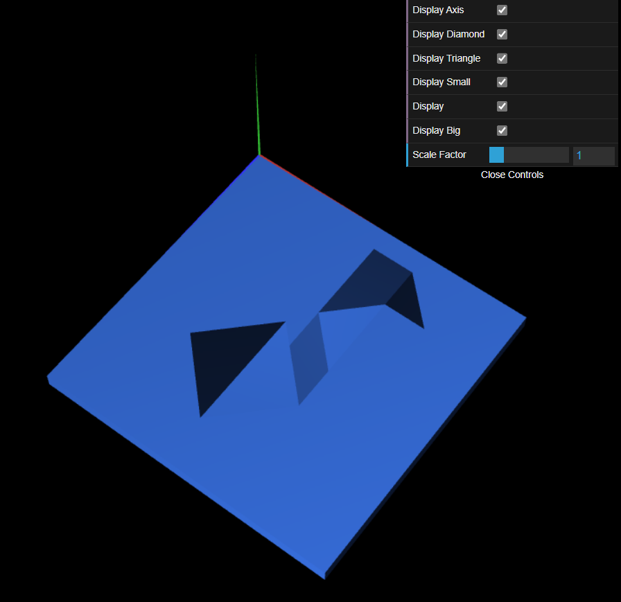

## Group T07G02

## TP 2 Notes

- We successfully created instances of each Tangram piece as individual objects and combined them to form the 81 Tangram shape. This was done by applying a series of translations, rotations, and scaling transformations to position each piece correctly relative to the origin. We also successfully 
- We also successfully created the MyUnitCube and MyUnitCubeQuad, to serve as a base for our Tangram. The second approach was more modular and organized.

