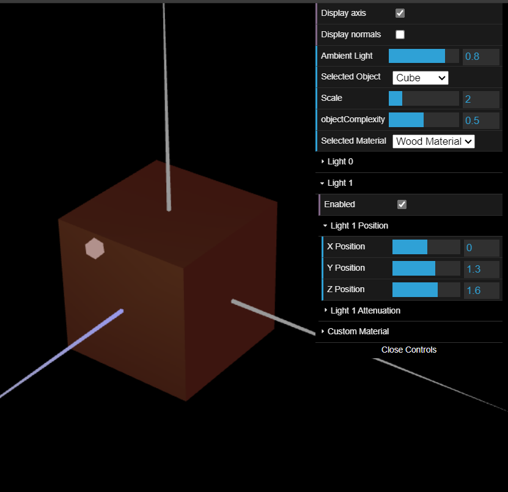
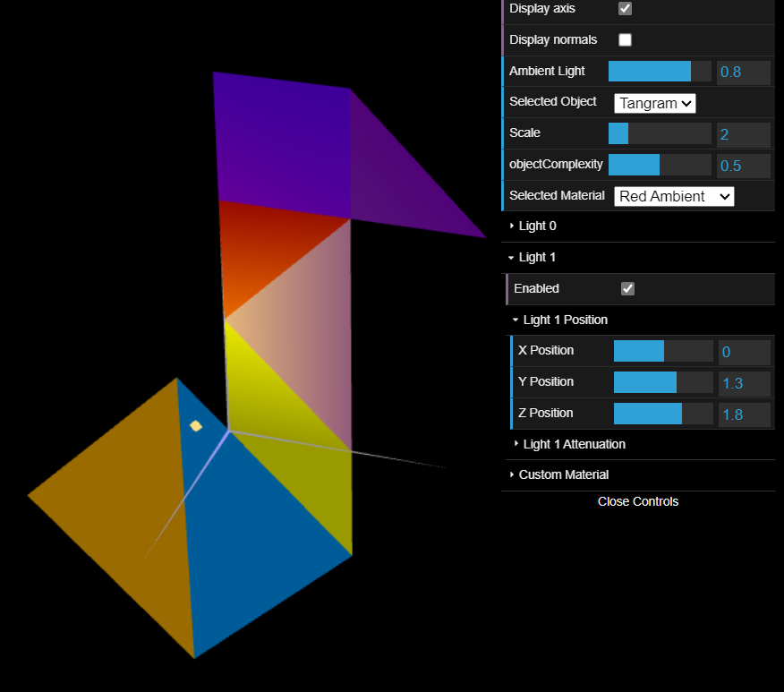
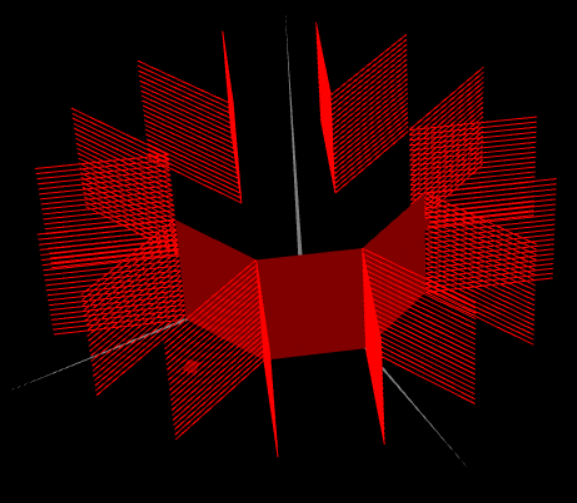
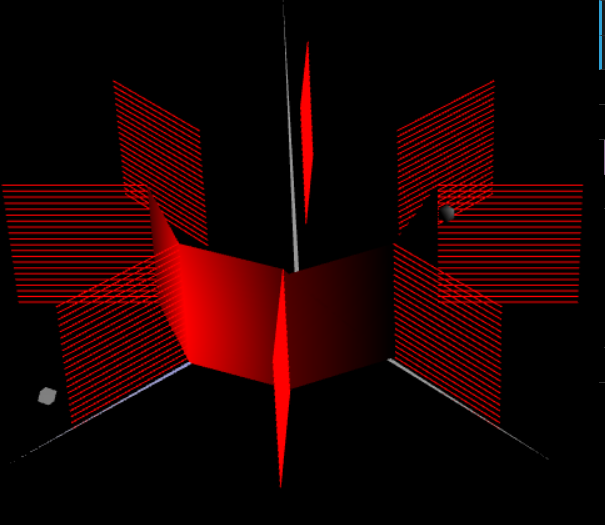

## Group T07G02

## TP 3 Notes

- We successfully declared the normals for all the cube and tangram vertices, and also for the tangram back part.
It was necessary to not use the same vertex index for both front and back normals.
- We created the wood material and colored each tangram component according to the original figure.
- We succesfully built a prism with height 1 and variable number of slices and stacks. However, it was a more challenging task than the rest of the exercices.
- Building the cylinder wasn't as challenging, since the necessary code didn't differ a lot from the prism. Even wish such small differences, the result was a prism which looked smoother.

