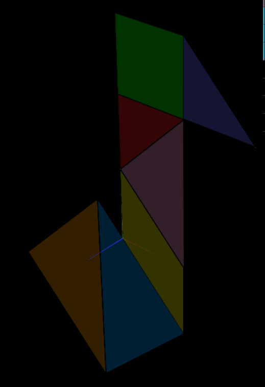
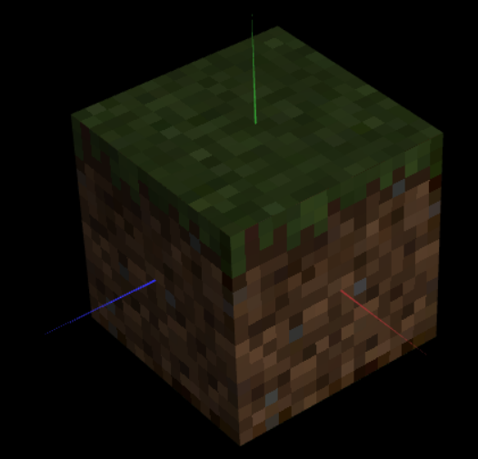

## Group T07G02

## TP 4 Notes

- We successfully colored the tangram using the tangram texture that was provided. The most challenging aspect of this task was to realize we needed to define two different objects for the big and small triangles.
- We applied the minecraft block texture to the cube.

