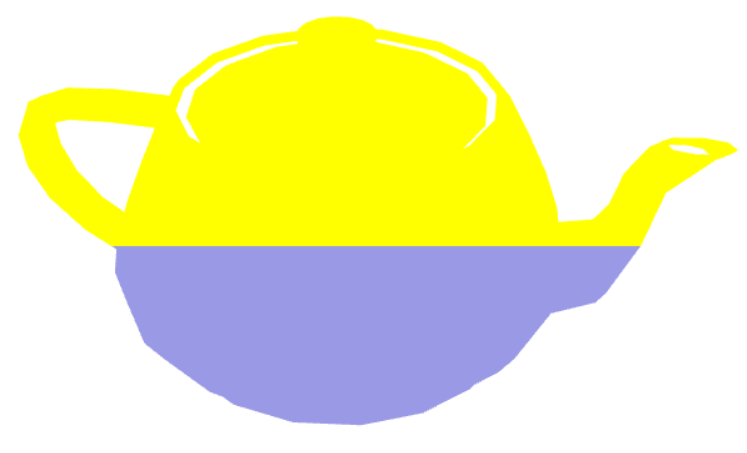
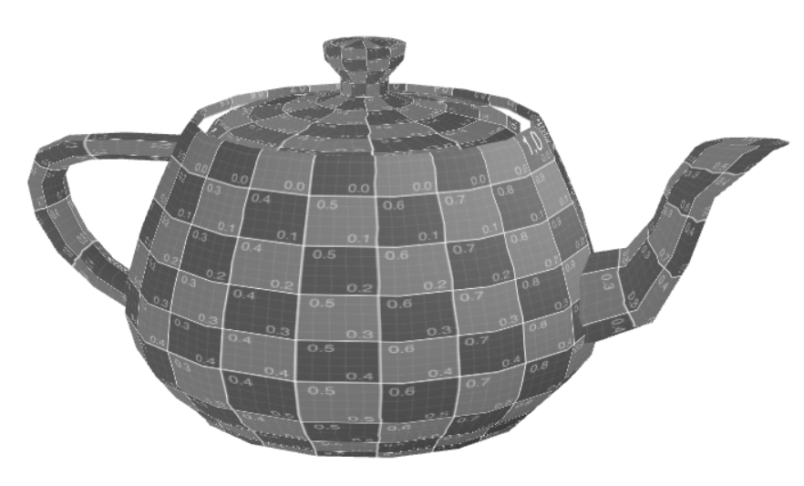
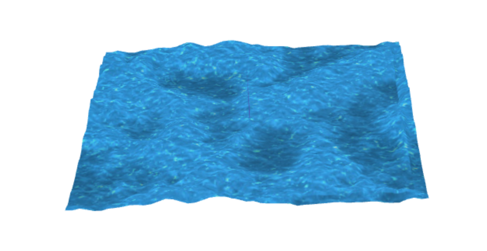

## Group T07G02

## TP 5 Notes

- We successfully created the Yellow-Blue vertex and fragment shaders, that depends on the y value.
- We created the animation translation effect, that depends on the scaleFactor, and also the Grayscale fragment shader, based on the Sepia logic.
- We created the water shaders, using the waterTex and waterMap textures, and animated it.

